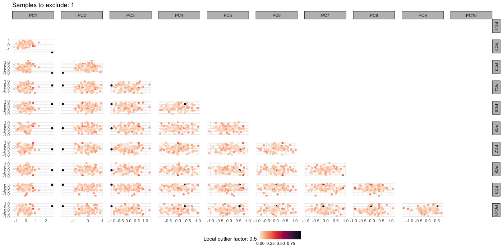

# OmicsProcessing

## Overview

The `OmicsProcessing` package offers two flexible ways to pre-process omics data (e.g., metabolomics or proteomics):

### 1. Semi-Automated Pipeline

Use the main `process_data()` function to run your data through a sequential, customizable pipeline with minimal setup. [Jump to the `process_data()` documentation](#the-process_data-documentation)

### 2. Modular Workflow

Build your own custom pipeline by combining individual functions. This provides maximum control over every processing step. [Jump to the Modular Workflow Guide](#modular-workflow)

### 3. Developer Guidelines

For contributors to the project, we maintain clear expectations on **coding style**, **documentation**, and **unit tests**. [Jump to Developer Guidelines](#developers--contributors)

### 4. Unit Testing Guidelines

All functionality is safeguarded by **unit tests** written using `testthat`.
We provide:

* Guidance on writing high-quality UTs.
* Best practices for naming and organizing tests.
* Instructions for running UTs locally.

[Jump to Unit Testing Guidelines](#unit-testing-guidelines)

---

## The `process_data()` documentation

This package provides a general function `process_data()` for the pre-analysis processing of omics data (e.g., metabolomics/proteomics). All processing steps are optional and can be tailored to the users specific requirements. This function performs the following processing steps (in order):

1. Excludes features with extreme missingness based on a specified threshold
2. Excludes samples with extreme missingness based on a specified threshold
3. Imputes missing values using various methods
4. Transforms the data using specified methods
5. Excludes outlying samples using PCA and LOF
6. Handles case-control data to ensure matched samples are treated appropriately
7. Corrects for plate effects using specified random and fixed effects
8. Centers and scales the data

Requires 3 data frames:

1. feature data
    * column 1 = sample IDs; column 2-N = features
    * example data: `data("data_features")`
2. feature meta-data
    * column 1 = feature column names; column 2-N = feature information (e.g., % missing, LOD)
    * example data: `data("data_meta_features")`
3. sample meta-data
    * column 1 = sample IDs; column 2-N = sample information (e.g., batch, age, sex)
    * example data: `data("data_meta_samples")`
    
Returns a list of:

1. `df_features`: processed feature dataframe
2. `df_meta_samples`: filtered sample meta-data
3. `df_meta_features`: filteres feature meta-data
4. `plot_samples_outlier`: figure of PCA/LOF analysis
5. `id_exclusions`: a list of IDs:
    * `id_features_exclude`: feature IDs excluded for extreme sample missingness
    * `id_samples_exclude`: sample IDs excluded for extreme sample missingness
    * `id_samples_outlier`: sample IDs excluded in PCA/LOF analysis
    * `id_samples_casecontrol`: sample IDs excluded because a matched case-control was excluded

## How
All arguments are independent and examples are given below. Each function (e.g., `impute_data()`) can be used independently of `process_data()`

### Sample and feature exclusions for >10% missingness

```r
data_processed <- process_data(
  data = data_features, 
  col_samples = "ID_sample", 
  exclusion_extreme_feature = TRUE, missing_pct_feature = 0.1,
  exclusion_extreme_sample = TRUE, missing_pct_sample = 0.1)

# Exclusion features: excluding features with more than 10% missingness 
## Exclusion features: excluded 44 feature(s) 
# Exclusion samples: excluding samples with more than 10% missingness 
## Exclusion samples: excluded 15 sample(s) 
### total feature(s) excluded = 44 
### total sample(s) excluded = 15 
# returning a list of data and exclusion IDs
```

### Imputation of missing feature data

```r
> data_processed <- process_data(
+   data = data_features, 
+   col_samples = "ID_sample", 
+   imputation = TRUE, imputation_method = "mean")

## Imputation using mean 
### total feature(s) excluded = 0 
### total sample(s) excluded = 0 
# returning a list of data and exclusion IDs
```

If imputing using limit of detection (LOD) or equivalent, you must provide a feature meta-data file which contains a column with feature names and a column of LOD or equivalent:

```r
data_processed <- process_data(
  data = data_features, 
  data_meta_features = data_meta_features, col_features = "ID_feature", col_LOD = "LOD",
  col_samples = "ID_sample", 
  imputation = TRUE, imputation_method = "LOD")
```

### Transformation of feature data
Ttransformation by all `log10` methods will also perform centering and scaling to a mean of 0

```r
> data_processed <- process_data(
+   data = data_features, 
+   col_samples = "ID_sample", 
+   transformation = TRUE, transformation_method = "InvRank")

## Transformation using InvRank 
### total feature(s) excluded = 0 
### total sample(s) excluded = 0 
# returning a list of data and exclusion IDs
```

### Sample outlier exclusions based on PCA and LOF

```r
> data_processed <- process_data(
+   data = data_features, 
+   col_samples = "ID_sample", 
+   exclusion_extreme_feature = TRUE, missing_pct_feature = 0.1,
+   exclusion_extreme_sample = TRUE, missing_pct_sample = 0.1,
+   imputation = TRUE, imputation_method = "mean",
+   outlier = TRUE)

# Exclusion features: excluding features with more than 10% missingness 
## Exclusion features: excluded 44 feature(s) 
# Exclusion samples: excluding samples with more than 10% missingness 
## Exclusion samples: excluded 15 sample(s) 
## Imputation using mean 
# Outlier exclusion using PCA and LOF 
## Excluded 0 sample(s)
## Creating sample outlier plot
### total feature(s) excluded = 44 
### total sample(s) excluded = 15 
# returning a list of data, outlier plot, and exclusion IDs
```

The outlier function creates a PCA plot where samples are coloured by their LOF. As an example, we can introduce an outlier sample by multiplying all feature values for ID_10 by 1.5:

```r
> data_features_outlier <- data_features %>%
+   dplyr::mutate(dplyr::across(2:101, ~ ifelse(dplyr::row_number() == 10, . * 1.5, .)))
> data_processed <- process_data(
+   data = data_features_outlier,
+   col_samples = "ID_sample", 
+   exclusion_extreme_feature = TRUE, missing_pct_feature = 0.1,
+   exclusion_extreme_sample = TRUE, missing_pct_sample = 0.1,
+   imputation = TRUE, imputation_method = "mean",
+   outlier = TRUE)

# Exclusion features: excluding features with more than 10% missingness 
## Exclusion features: excluded 44 feature(s) 
# Exclusion samples: excluding samples with more than 10% missingness 
## Exclusion samples: excluded 15 sample(s) 
## Imputation using mean 
# Outlier exclusion using PCA and LOF 
## Excluded 1 sample(s)
## Creating sample outlier plot
### total feature(s) excluded = 44 
### total sample(s) excluded = 16 
# returning a list of data, outlier plot, and exclusion IDs
```


### Plate correction
You can perform plate correction by providing sample and feature meta-data files.

```r
data_processed <- process_data(
  data = data_features, 
  data_meta_samples = data_meta_samples,
  col_samples = "ID_sample", 
  data_meta_features = data_meta_features,
  col_features = "ID_feature",
  plate_correction = TRUE, 
  cols_listRandom = c("batch"), 
  cols_listFixedToKeep = c("age"), 
  cols_listFixedToRemove = c("sex"), 
  col_HeteroSked = NULL)
```

### Other
Centering and scaling can be performed using `centre_scale = TRUE`. Centering and scaling is performed for log based transformations at the point of the transformation, regardless of if `centre_scale = TRUE`. 

If you are processing case-control data then you will likely want to ensure excluded samples have their matched samples also excluded. This can be done using `case_control = TRUE` and providing the column name in `data_meta_samples` which has the matching factor, `col_case_control = case_control_match`.

The processed data, the IDs for excluded samples and features and the reasons for exclusions, and the outlier plot can be saved using `save = TRUE` and providing a file path for the processed data (`path_out = path/to/directory/`) and the exclusion data (`path_outliers = path/to/directory/exclusions/`)

## References

1. Application of linear mixed models to remove unwanted variability (e.g., batch) and preserve biological variations while accounting for potential differences in the residual variances across studies (Viallon et al., 2021). The functions implementing this (`normalization_residualMixedModels()` and `FUNnormalization_residualMixedModels()`) utilise the R packages [`{pcpr2}`](https://github.com/JoeRothwell/pcpr2), [`{lme4}`](https://github.com/lme4/lme4), and [`{nlme}`](https://cran.r-project.org/web/packages/nlme/index.html) 
    * Viallon V, His M, Rinaldi S, et al. A New Pipeline for the Normalization and Pooling of Metabolomics Data. Metabolites. 2021;11(9):631. Published 2021 Sep 17. [doi:10.3390/metabo11090631](https://pmc.ncbi.nlm.nih.gov/articles/PMC8467830/).
    * `{PCPR2}`: Fages & Ferrari et al. (2014) Investigating sources of variability in metabolomic data in the EPIC study: the Principal Component Partial R-square (PC-PR2) method. Metabolomics 10(6): 1074-1083, [doi: 10.1007/s11306-014-0647-9](https://link.springer.com/article/10.1007/s11306-014-0647-9)
    * `{lme4}`: Bates, D., Mächler, M., Bolker, B., & Walker, S. (2015). Fitting Linear Mixed-Effects Models Using lme4. Journal of Statistical Software, 67(1), 1–48. [doi.org/10.18637/jss.v067.i01](https://www.jstatsoft.org/article/view/v067i01).
    * `{nlme}`: Pinheiro, J. C. & Bates, D. M. Mixed-Effects Models in S and S-PLUS. (Springer, New York, 2000). [doi:10.1007/b98882](https://link.springer.com/book/10.1007/b98882)
2. Sample exclusion performed using principal component analyses and a local outlier factor (Breuing et al., 2000) using a Tukey rule (Tueky, 1977) modified to account for skewness and multiple testing (Hubert and Vandervieren, 2008)
    * Markus M. Breunig, Hans-Peter Kriegel, Raymond T. Ng, and Jörg Sander. 2000. LOF: identifying density-based local outliers. SIGMOD Rec. 29, 2 (June 2000), 93–104. [doi.org/10.1145/335191.335388](https://dl.acm.org/doi/10.1145/335191.335388)
    * Tukey, J. W. Exploratory Data Analysis. (Addison-Wesley Publishing Company, 1977).
    * Hubert, M. and Vandervieren, E., (2008), An adjusted boxplot for skewed distributions, Computational Statistics & Data Analysis, 52, issue 12, p. 5186-5201, [EconPapers.repec.org/RePEc:eee:csdana:v:52:y:2008:i:12:p:5186-5201](https://EconPapers.repec.org/RePEc:eee:csdana:v:52:y:2008:i:12:p:5186-5201).
3. The implementation of sample exclusions is from the R package [`{bigutilsr}`](https://github.com/privefl/bigutilsr) and is described in detail by Florian Privé in [this blog post](https://privefl.github.io/blog/detecting-outlier-samples-in-pca/)

<!-- Existing README content remains unchanged here -->

---

## Modular Workflow

The following example illustrates a custom pipeline using individual functions from the package. Each section is accompanied by an explanation and guidance. For detailed parameter descriptions, please refer to the function documentation (e.g., `?OmicsProcessing::filter_by_missingness`).

This modular approach is particularly useful for users who need detailed control over processing steps or want to adapt parts of the pipeline to specific datasets or experimental designs.

### Step 1: Filter by missingness

```r
filtered_df <- OmicsProcessing::filter_by_missingness(
  df,
  row_thresh = 0.5,  # Remove features with >50% missingness
  col_thresh = 0.5,  # Remove samples with >50% missingness
  target_cols = "@",  # Automatically detect feature columns
  is_qc = grepl("^sQC", df$sample_type),  # Identify QC samples
  filter_order = "iterative"  # Default: iterative filtering
)
```

This step removes features and/or samples with a high proportion of missing values. You can customise thresholds and specify which samples are Quality Control (QC). **QC rows are always retained in the returned dataset, but they are excluded when calculating the missingness proportions.** You can either pass a regular expression for automatic feature column detection (for example with `target_cols = "@"` the function will classify all columns that have the `@` as a feature column).

---

#### Filtering order (`filter_order`)

The parameter `filter_order` controls the sequence in which row and column filtering is applied:

* **`"iterative"` (default):** Alternates between row and column filtering until results stop changing (or `max_iter` is reached). Ensures that both row and column thresholds are satisfied simultaneously.
* **`"col_then_row"`:** Removes columns first, then filters rows.
* **`"row_then_col"`:** Removes rows first, then filters columns.
* **`"simultaneous"`:** Determines rows and columns to keep independently, then intersects the results.

The `"iterative"` option is generally more conservative: it repeatedly refines the dataset until both row and column criteria are satisfied, which can produce different results compared to the one-pass methods.

---

#### Example

For the dataset below (rows 2 and 5 are marked as QC):

```r
df <- data.frame(
  a = c(NA, 1, NA, 1, NA),
  b = c(NA, NA, 2, 2, NA),
  c = c(3, NA, NA, 3, NA),
  d = 1
)
is_qc <- c(FALSE, TRUE, FALSE, FALSE, TRUE)
target_cols <- c("a","b","c")

df
#    a  b  c d
# 1 NA NA  3 1
# 2  1 NA NA 1   <- QC
# 3 NA  2 NA 1
# 4  1  2  3 1
# 5 NA NA NA 1   <- QC
```

Different `filter_order` choices yield different results:

```r
# Iterative (default)
filter_by_missingness(df, 0.5, 0.5, target_cols, is_qc, filter_order = "iterative")
#    b  c d
# 1 NA  3 1
# 2 NA NA 1
# 3  2 NA 1
# 4  2  3 1
# 5 NA NA 1

# Simultaneous
filter_by_missingness(df, 0.5, 0.5, target_cols, is_qc, filter_order = "simultaneous")
#    b  c d
# 2 NA NA 1
# 4  2  3 1
# 5 NA NA 1
```

Notice how **row 1 is retained in the iterative case but dropped in the simultaneous case**, because the iterative procedure keeps alternating until both row and column criteria are satisfied together.


---

### Step 2: Outlier removal using PCA + LOF

```r
outlier_results <- OmicsProcessing::remove_outliers(
  filtered_df,
  target_cols = "@",
  is_qc = grepl("^sQC", filtered_df$sample_type),
  method = "pca-lof-overall",
  impute_method = "half-min-value",
  restore_missing_values = TRUE,
  return_ggplots = TRUE
)
clean_df <- outlier_results$df_filtered
```

This function detects and removes outliers from the dataset using a PCA + Local Outlier Factor (LOF) workflow. Outliers are identified only among non-QC samples. Missing values can be imputed temporarily for detection, and original `NA`s can be restored afterward. If `return_ggplots = TRUE`, PCA plots are returned (see notes below). See `?remove_outliers`.

#### Optional: stratified outlier detection (`strata`)

By default, **no stratification** is used (all non-QC samples are assessed together). You can optionally provide a **stratification variable** so that outlier detection runs **independently within each stratum**, and results are then merged:

* Supply `strata` as either:

  * the **name of a column** in `df`, or
  * an **external vector** of length `nrow(df)` (e.g., a custom grouping).
* Within each stratum:

  * QC rows are **excluded** from detection (but always kept in the final output).
  * If `impute_method = "half-min-value"`, imputation is performed **within that stratum** on `target_cols`.
  * PCA → LOF → Tukey thresholding are applied to identify outliers.
* The function returns the union of outlier sample IDs across strata and removes only those from the non-QC portion before recombining with QC rows.
* When `return_ggplots = TRUE`, you’ll get a **named list of per-stratum plots** in `outlier_results$plot_samples_outlier`.

**Examples**

```r
## 1) No stratification (default)
res <- OmicsProcessing::remove_outliers(
  df, 
  target_cols = c("f1","f2","f3"),
  is_qc = df$sample_type == "sQC"
)

## 2) Stratify by a column (e.g., batch)
res_batch <- OmicsProcessing::remove_outliers(
  df, 
  target_cols = c("f1","f2","f3"),
  is_qc = df$sample_type == "sQC",
  strata = "batch",
  return_ggplots = TRUE
)

## 3) Stratify by an external vector
grp <- ifelse(df$center %in% c("C1","C2"), "C12", "C3")
res_grp <- OmicsProcessing::remove_outliers(
  df, 
  target_cols = tidyselect::starts_with("feat_"),
  is_qc = df$sample_type == "sQC",
  strata = grp,
  restore_missing_values = TRUE
)
```

#### Implementation notes & requirements

* **PCA:** implemented via `stats::prcomp()`.
* **LOF distances:** computed with `bigutilsr::LOF()`.
* **Outlier thresholding:** via `bigutilsr::tukey_mc_up()`.

Practical constraints:

* You must have **enough non-QC samples per stratum** for PCA and LOF to be meaningful. Very small strata (e.g., < \~8–10 samples) may yield unstable or invalid LOF results.
* Features in `target_cols` should be **numeric**, with **no infinite values**; missing values are handled by the optional imputation step but **constant/zero-variance features** can break PCA.
* LOF requires a number of neighbors (`K`); if a stratum has too few samples relative to `K`, `LOF()` may error or degenerate. As a rule of thumb, ensure **`n_samples_stratum >> K`**.
* Very high **p/n ratios** (many more features than samples) can make PCA and LOF unstable. Consider filtering features before running this step.
* **ggplot generation requires at least 10 feature columns** in `target_cols`. If fewer than 10 are provided, plots cannot be generated; in such cases you should leave `return_ggplots = FALSE` (the default).

**Returned values**

* `df_filtered`: input `df` with detected outlier **non-QC** rows removed (QC rows always retained).
* `excluded_ids`: vector of removed row names (union across strata).
* `plot_samples_outlier`: `NULL` or a **named list of ggplot objects** (one per stratum) when `return_ggplots = TRUE` *and* `length(target_cols) >= 10`.

---

### Step 3: Log transformation

```r
feature_cols <- OmicsProcessing::resolve_target_cols(clean_df, "@")
log_transformed_df <- clean_df %>%
  dplyr::mutate(dplyr::across(
    .cols = tidyselect::all_of(feature_cols),
    .fns = ~ log1p(.x),
    .names = "{.col}"
  ))
```

Applies a log(1 + x) transformation to all identified feature columns. This reduces skewness and helps stabilize variance. Use `OmicsProcessing::resolve_target_cols()` to specify features via name or regex. See `?resolve_target_cols`.

---

### Step 4: Hybrid Imputation (Random Forest + LCMD)

```r
imputed_results <- OmicsProcessing::hybrid_imputation(
  log_transformed_df,
  target_cols = "@",
  method = c("RF-LCMD"),
  oobe_threshold = 0.1
)
imputed_df <- imputed_results$hybrid_rf_lcmd
```

This function combines two complementary imputation strategies:

* **Random Forest (RF)** via `missForest::missForest()` for features that are well-predicted by other variables (low OOBE)
* **Left-Censored Missing Data (LCMD)** via `imputeLCMD::impute.MAR.MNAR()` for features with higher OOBE

The function automatically decides, per feature, which method to use based on the out-of-bag error (OOBE) returned by the RF model.

You can inspect the imputed results (`$hybrid_rf_lcmd`), the individual method outputs (`$rf`, `$lcmd`), and the OOBE values (`$oob`).

See `?OmicsProcessing::hybrid_imputation` for details.

The behavior of the imputation methods used in `OmicsProcessing::hybrid_imputation()` can be fine-tuned using control lists.

To customize `missForest::missForest()`:

```r
my_control_RF <- list(
  parallelize = "no",
  mtry = floor(sqrt(length(target_cols))),
  ntree = 100,
  maxiter = 10,
  variablewise = TRUE,
  verbose = TRUE,
  n_cores = parallel::detectCores()
)
```

To customize `imputeLCMD::impute.MAR.MNAR()`:

```r
my_control_LCMD <- list(
  method.MAR = "KNN",
  method.MNAR = "QRILC"
)
```

These can then be passed to the imputation call as:

```r
df_rf_lcmd_hybrid <- OmicsProcessing::hybrid_imputation(
  ...,
  control_LCMD = my_control_LCMD,
  control_RF = my_control_RF
)
```

This allows full control over the imputation process, useful when dealing with complex missingness structures or benchmarking different strategies.

---

### Step 5: Batch correction using SERRF

```r
imputed_df <- imputed_df %>%
  dplyr::mutate(batch = factor(batch))

out_serrf <- OmicsProcessing::normalise_SERRF_by_batch(
  imputed_df,
  target_cols = "@",
  is_qc = grepl("^sQC", imputed_df$sample_type),
  batch_col = "batch"
)
```

This step performs normalisation across batches using the SERRF method. It models unwanted technical variation using QC samples within each batch. Feature columns can be specified via name or regex. See `?OmicsProcessing::normalise_SERRF_by_batch`.

## Developers & Contributors

We welcome contributions to **OmicsProcessing**!
Our highest priority is **clean code** and **good documentation** — with emphasis on *good*.

### How to Contribute

* Fork the repository.
* Create a new **issue** describing your objective or planned change.
* Develop your changes on a **separate branch**.
* Once finished, open a **pull request** for review.

All pull requests must pass **unit tests (UTs)** and include clear documentation.

---

### Coding Style Guidelines

* **Modular design** is preferred: each task should be factored into its own function.
* **Naming conventions**: all variable and function names must be lowercase, separated by underscores (`snake_case`), and be meaningfully descriptive.
* **Function documentation**: every function must have complete **roxygen2** documentation, including at least one example.
* **LLM-assisted cleanup**: we strongly recommend using LLMs to improve code clarity, formatting, and variable naming suggestions.

#### Example function with roxygen2 documentation

```r
#' Add Two Numbers
#'
#' This function takes two numeric values and returns their sum.
#'
#' @param x A numeric value.
#' @param y A numeric value.
#'
#' @return A numeric value representing the sum of `x` and `y`.
#' @export
#'
#' @examples
#' add_two_numbers(1, 2)
#' add_two_numbers(-5, 10)
add_two_numbers <- function(x, y) {
  x + y
}
```

**Note on `@export`**
Functions marked with `@export` are made available to end users of the package. Functions without `@export` remain internal helpers: they can still be tested and documented, but they are not part of the public API.

---

### Unit Tests (UTs)

Every function must have accompanying **unit tests**. Unit tests check function behavior and serve as guidance for future developers when modifications are required.

#### Example unit test

```r
test_that("add_two_numbers works as expected", {
  expect_equal(add_two_numbers(1, 2), 3)
  expect_equal(add_two_numbers(-5, 10), 5)
  expect_true(is.numeric(add_two_numbers(2, 2)))
})
```

---


### Writing Good UTs (mini‑guide)

Good tests verify **behavior** (public API contracts), not implementation details. Aim for small, fast, and deterministic tests.

**What to cover**

* **Happy path:** the typical, correct usage.
* **Edge cases:** empty inputs, single row/column, NA/NaN/Inf, duplicated IDs, extreme values.
* **Bad inputs:** wrong types/shapes; assert errors with informative messages.
* **Boundaries:** off‑by‑one, min/max thresholds, zero/negative values.
* **Stochastic steps:** set seeds for reproducibility.

**Expectations to prefer**

* Exact equality: `expect_identical()` (strictest).
* Numeric comparisons: `expect_equal(..., tolerance = 1e-8)` (floating point).
* Types/classes: `expect_s3_class(obj, "data.frame")`.
* Names/columns: `expect_named(df, c("sample_id","metabolite","intensity"))`.
* Logical properties: `expect_true(all(df$intensity >= 0))`.

**Errors, warnings, messages**

```r
expect_error(fn(bad_arg), class = "my_pkg_error")     # test classed errors
expect_warning(fn(x), "deprecated")                   # or a pattern
expect_message(fn(verbose = TRUE), "Completed step")
```

**Data‑frame outputs**
Check structure over exact values when appropriate:

```r
out <- normalize_intensity(df, method = "median")
expect_s3_class(out, "data.frame")
expect_true(all(c("sample_id","metabolite","intensity_norm") %in% names(out)))
expect_equal(nrow(out), nrow(df))
```

**Fixtures & temporary files**

* Put tiny example inputs under `tests/testthat/fixtures/` (or `inst/extdata/` for examples).
* Use `withr::local_tempdir()` / `local_tempfile()` to avoid polluting the repo.
* Load fixture paths via `testthat::test_path("fixtures", "tiny_input.csv")`.

---

### Tests Directory Structure & Naming

**Recommended layout**

```
OmicsProcessing/
├─ R/
├─ tests/
│  ├─ testthat.R
│  └─ testthat/
│     ├─ test-process_data.R
│     ├─ test-normalize_intensity.R
│     ├─ test-impute_values.R
│     ├─ helper-setup.R
│     └─ fixtures/
│        ├─ tiny_input.csv
│        └─ tiny_metadata.csv
└─ ...
```

**Files**

* `tests/testthat.R` (boilerplate):

  ```r
  library(testthat)
  library(OmicsProcessing)
  test_check("OmicsProcessing")
  ```
* **Unit test files** live in `tests/testthat/` and must start with `test-*.R`.

  * One file per exported function or cohesive feature:

    * `test-normalize_intensity.R`
    * `test-impute_values.R`
    * `test-integration-process_data.R` (for end‑to‑end/integration)
* **Fixtures** (tiny static inputs) go under `tests/testthat/fixtures/`.

**Naming conventions**

* **Files:** `test-<function_or_feature>.R`
* **Tests:** use clear, behavior‑oriented descriptions:

  ```r
  test_that("normalize_intensity rescales to median = 1 per sample", { ... })
  test_that("process_data() errors on missing required columns", { ... })
  ```

---

### Running Unit Tests

**Everything**

```r
devtools::test()
```

**Filter by file or name**

```r
devtools::test(filter = "normalize_intensity") # matches file or test name
testthat::test_file("tests/testthat/test-impute_values.R")
```

**Coverage (optional but encouraged)**

```r
# in the package root
covr::report()   # opens HTML coverage report
```
