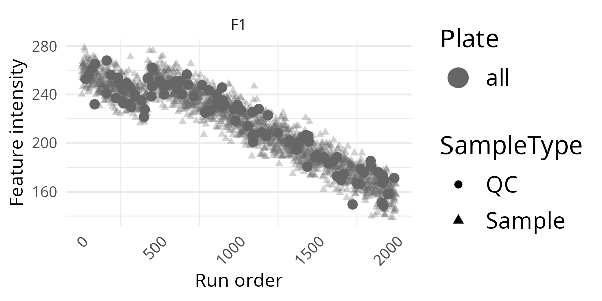
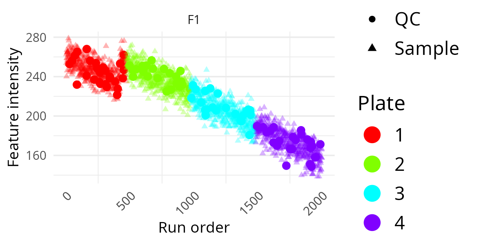
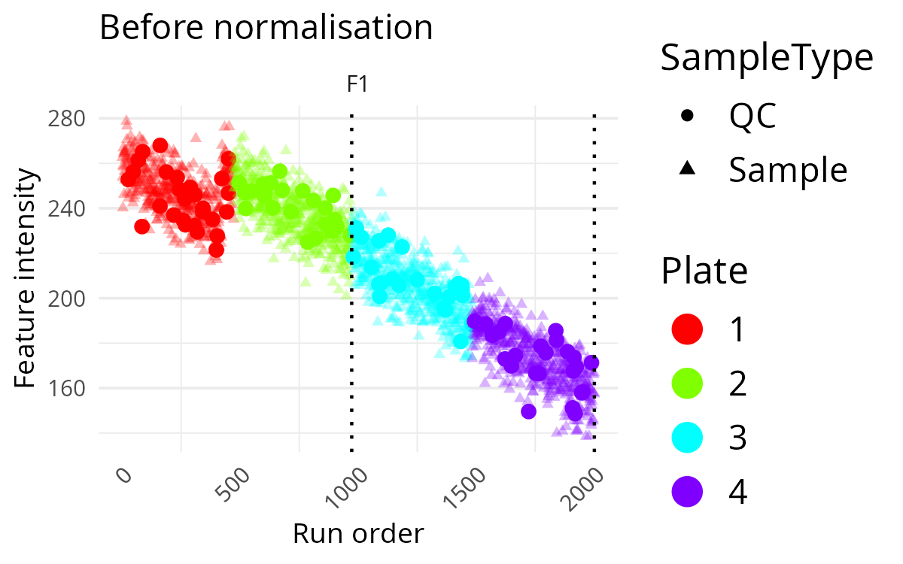
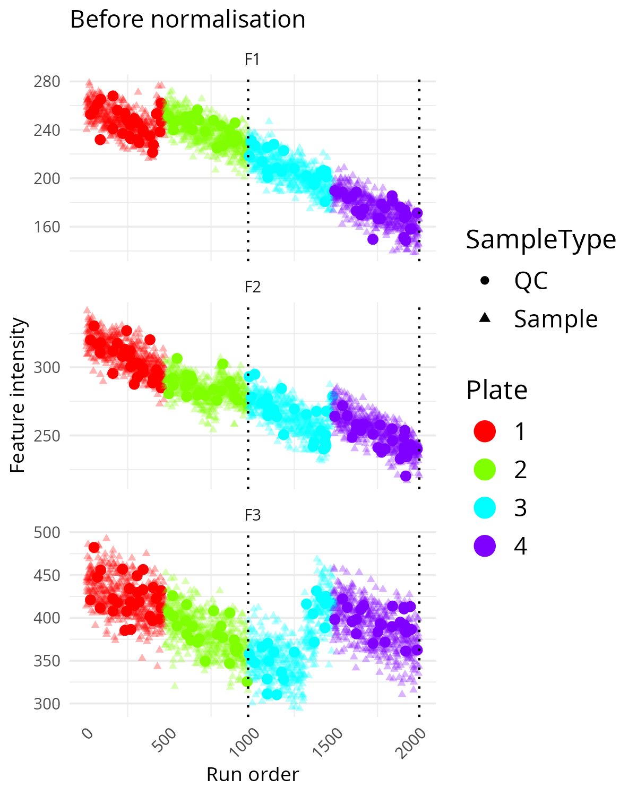
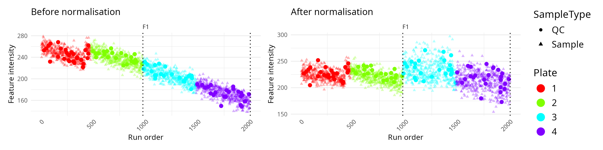
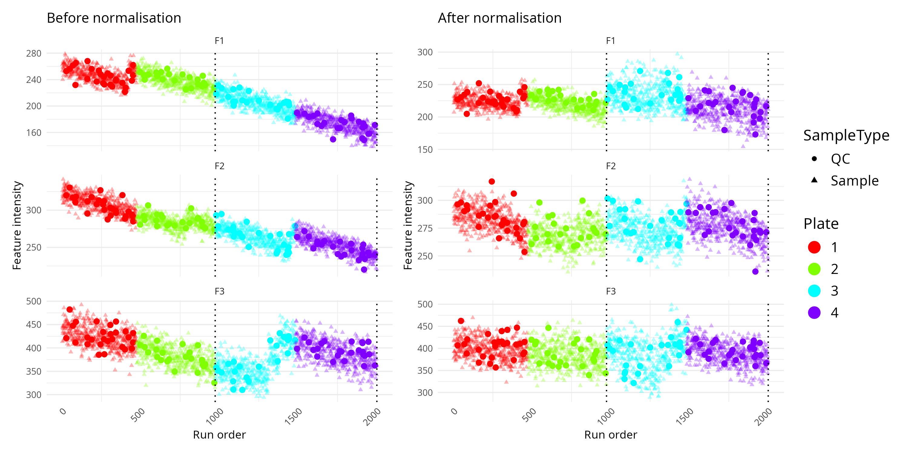

# Normalisation plot comparison

## Overview

This vignette shows how to use
[`OmicsProcessing::plot_omics_distributions()`](https://iarcbiostat.github.io/OmicsProcessing/reference/plot_omics_distributions.md)
to inspect how one or more features behave across run order.

These plots are useful when you want to answer practical questions such
as:

- Do measurements drift over time during the run?
- Do QC samples behave differently from study samples?
- Are there visible plate or batch effects?
- Does normalisation reduce unwanted technical structure?

You do not need to prepare your own data to follow this vignette. The
package contains a built-in synthetic example data set called
`omics_synthetic`.

Reproducible data-generation code for `omics_synthetic` is available in
the source repository at `data-raw/omics_synthetic.R`. After package
installation, you can locate the installable copy with:

[Function reference for
`build_omics_synthetic()`](https://iarcbiostat.github.io/OmicsProcessing/reference/build_omics_synthetic.md)

``` r
system.file("scripts", "omics_synthetic.R", package = "OmicsProcessing")
```

## Load example data

``` r
data("omics_synthetic", package = "OmicsProcessing")

omics_synthetic
```

The example data contains:

- `F1` to `F10`: feature intensity columns
- `run_ord`: the injection or acquisition order
- `is_qc`: a logical column indicating QC samples
- `plate_id`: plate membership
- `batch_id`: batch membership

In practice, your own data should contain the same kind of information,
even if your column names are different. The plotting function lets you
specify your own column names explicitly, so your data does not need to
look exactly like this example.

## Plot Feature Distributions With Minimal Inputs

The smallest useful call needs only:

- a data frame,
- one or more feature columns, and
- a run-order column.

``` r
p <- OmicsProcessing:::plot_omics_distributions(
  df = omics_synthetic,
  target_cols = "F1",
  run_order = "run_ord"
)

p
```

This first version is a good screening plot. It lets you see whether the
feature stays roughly stable over the analytical run or whether it shows
drift or sudden shifts. For a first check of a new data set, this is
often the best place to start because it keeps the display simple.


## Add Information Layers

The same plot becomes much more informative once you add sample
annotations. The following examples build up the plot step by step.

### Add QC Indicator

If your data contains QC samples, adding `is_qc` helps distinguish
technical control samples from study samples.

``` r
p <- OmicsProcessing:::plot_omics_distributions(
  df = omics_synthetic,
  target_cols = "F1",
  run_order = "run_ord",
  is_qc = "is_qc"
)

p
```

This is often the most informative extra layer. If QC points follow a
clear trend across run order, that usually suggests technical drift
rather than a biological effect.



### Add Plate Information

If samples were measured across different plates, colouring by plate can
reveal plate-to-plate shifts.

``` r
p <- OmicsProcessing:::plot_omics_distributions(
  df = omics_synthetic,
  target_cols = "F1",
  run_order = "run_ord",
  is_qc = "is_qc",
  plate = "plate_id"
)

p
```

This is useful when you suspect systematic differences between
laboratory processing groups. If one plate forms a visibly separate
pattern, that may indicate a technical rather than biological source of
variation.



### Add Batch Information And A Title

If you also provide a batch column, the function draws dotted vertical
lines at batch boundaries.

``` r
p <- OmicsProcessing:::plot_omics_distributions(
  df = omics_synthetic,
  target_cols = "F1",
  run_order = "run_ord",
  is_qc = "is_qc",
  plate = "plate_id",
  batch = "batch_id",
  title_ref = "Before normalisation"
)

p
```

This makes it easier to spot abrupt changes that happen at batch
transitions rather than gradually over time. A sharp level change at a
batch boundary is often a sign that batch correction may be needed.



## Plot Multiple Features

You can inspect several features at once by supplying multiple feature
names.

``` r
p <- OmicsProcessing:::plot_omics_distributions(
  df = omics_synthetic,
  target_cols = c("F1", "F2", "F3"),
  run_order = "run_ord",
  is_qc = "is_qc",
  plate = "plate_id",
  batch = "batch_id",
  title_ref = "Before normalisation"
)

p
```

This is a useful compromise between single-feature inspection and a full
multivariate summary. It helps identify whether technical problems are
restricted to one feature or shared across several. If several features
show similar drift or step changes, the pattern is more likely to be a
technical artefact.



## Compare Feature Distributions Before And After Normalisation

This function is especially useful when you want to compare a raw or
pre-processed data set against a normalised version.

Typical preparation steps are:

1.  filter features and samples,
2.  impute missing values if needed,
3.  normalise the data, and
4.  compare the before/after distributions.

``` r
target_features <- c("F1", "F2", "F3")

df_imputed <- omics_synthetic

df_normalised <- OmicsProcessing::normalise_SERRF(
  df_imputed,
  target_cols = target_features,
  is_qc = df_imputed$is_qc,
  strata_col = "batch_id"
)

OmicsProcessing:::plot_omics_distributions(
  df = df_imputed,
  df_comp = df_normalised,
  target_cols = target_features,
  run_order = "run_ord",
  is_qc = "is_qc",
  batch = "batch_id",
  plate = "plate_id",
  title_ref = "Before normalisation",
  title_comp = "After normalisation"
)
```

If you want a simpler visual comparison first, you can start with a
single feature and then expand to several features once you understand
the overall behaviour.

``` r
OmicsProcessing:::plot_omics_distributions(
  df = df_imputed,
  df_comp = df_normalised,
  target_cols = "F1",
  run_order = "run_ord",
  is_qc = "is_qc",
  batch = "batch_id",
  plate = "plate_id",
  title_ref = "Before normalisation",
  title_comp = "After normalisation"
)
```



In this comparison mode, the left panel usually represents the original
data and the right panel the corrected data. You can then judge whether
the normalisation has reduced technical drift while keeping the overall
signal structure plausible.

This can also plot multiple columns and compare them like so:

``` r
target_features <- c("F1", "F2", "F3")

OmicsProcessing:::plot_omics_distributions(
  df = df_imputed,
  df_comp = df_normalised,
  target_cols = target_features,
  run_order = "run_ord",
  is_qc = "is_qc",
  batch = "batch_id",
  plate = "plate_id",
  title_ref = "Before normalisation",
  title_comp = "After normalisation"
)
```



## Interpretation Tips

- A smooth trend in QC samples across run order often indicates
  technical drift.
- Sudden jumps at batch boundaries suggest batch effects.
- Plate-specific colour clusters may indicate plate effects.
- After successful normalisation, QC samples often look more stable
  across the run.
- If the corrected plot looks overly distorted or compressed, inspect
  the normalisation settings before proceeding.

If you are using SERRF for correction, see the related vignette: [Batch
correction using
SERRF](https://iarcbiostat.github.io/OmicsProcessing/articles/serrf-normalisation.md).

## Reproducing The Example Data

The example data set can be regenerated from the package source.

[Function reference for
`build_omics_synthetic()`](https://iarcbiostat.github.io/OmicsProcessing/reference/build_omics_synthetic.md)

``` r
source("data-raw/omics_synthetic.R")
```

If you want to inspect or modify the generator first, use:

[Function reference for
`build_omics_synthetic()`](https://iarcbiostat.github.io/OmicsProcessing/reference/build_omics_synthetic.md)

``` r
generated <- build_omics_synthetic(seed = 1)

str(generated$omics_synthetic)
head(generated$jump_info)
```

For most users, the packaged `omics_synthetic` data will be enough for
learning and testing. The generator is mainly useful if you want to
change the simulation settings or create additional benchmark examples.
